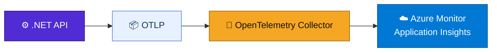
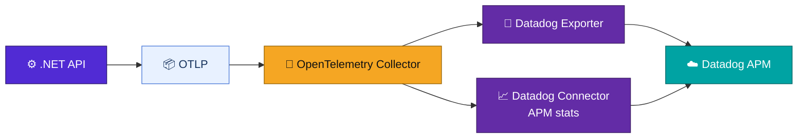
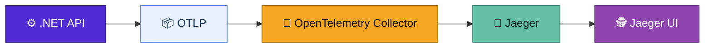
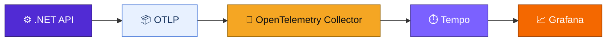
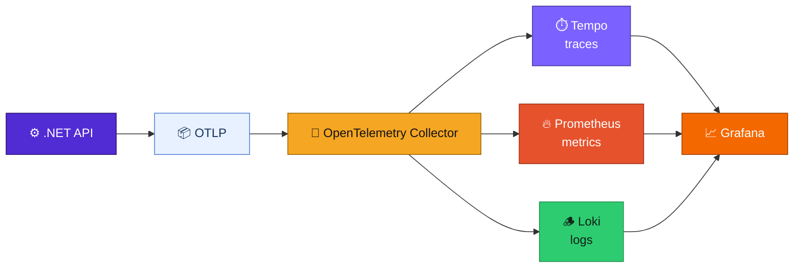

# .NET Aspire APM Backend Comparison Demo

This proof-of-concept demonstrates how to compare different APM/observability backends using OpenTelemetry Collector with a single .NET Aspire API service.

## Purpose

Compare different APM/observability solutions with the same .NET API service:
- **Switching backends** requires changing only Aspire infrastructure and Collector configuration
- **No application code changes** required when switching backends
- **Backend-neutral** API that only knows about OpenTelemetry and the Collector

## Architecture

### Core Flow

```
.NET API
  → OTLP exporter
  → OpenTelemetry Collector
  → selected backend
```

### 1. Elastic APM / ELK Stack

```mermaid
graph LR
    A["⚙️ .NET API"] --> B["📦 OTLP"]
    B --> C["🔭 OpenTelemetry Collector"]
    C --> D["🟣 Elastic APM Server"]
    D --> E["🔎 Elasticsearch"]
    E --> F["📊 Kibana"]

    classDef app fill:#512BD4,stroke:#2b166f,color:#fff
    classDef protocol fill:#E8F1FF,stroke:#4C7BD9,color:#16325C
    classDef collector fill:#F5A623,stroke:#9A6400,color:#111
    classDef elastic fill:#00BFB3,stroke:#00756E,color:#061D1B
    classDef ui fill:#F04E98,stroke:#A91F62,color:#fff
    class A app
    class B protocol
    class C collector
    class D,E elastic
    class F ui
```



### 2. Azure Application Insights



### 3. Datadog APM



### 4. Jaeger



### 5. Grafana Tempo



### 6. Full Grafana Stack



## How to Run

### Prerequisites

- Docker Desktop (with Kubernetes support)
- .NET 10 SDK
- Aspire workload installed (`dotnet workload install aspire`)

### Running with Different Backends

Set the `OBSERVABILITY_BACKEND` environment variable before running:

```bash
# Elastic APM / ELK Stack
$env:OBSERVABILITY_BACKEND="elastic"
dotnet run --project src/AspireApmBackendsDemo.AppHost

# Azure Application Insights
$env:OBSERVABILITY_BACKEND="appinsights"
$env:APPLICATIONINSIGHTS_CONNECTION_STRING="your-connection-string"
dotnet run --project src/AspireApmBackendsDemo.AppHost

# Datadog APM
$env:OBSERVABILITY_BACKEND="datadog"
$env:DD_API_KEY="your-datadog-api-key"
$env:DD_SITE="datadoghq.com"
dotnet run --project src/AspireApmBackendsDemo.AppHost

# Jaeger
$env:OBSERVABILITY_BACKEND="jaeger"
dotnet run --project src/AspireApmBackendsDemo.AppHost

# Grafana Tempo
$env:OBSERVABILITY_BACKEND="tempo"
dotnet run --project src/AspireApmBackendsDemo.AppHost

# Full Grafana Stack (Tempo + Prometheus + Loki)
$env:OBSERVABILITY_BACKEND="grafana-full"
dotnet run --project src/AspireApmBackendsDemo.AppHost
```

## Application Insights Setup

When using `appinsights` backend, you must set the `APPLICATIONINSIGHTS_CONNECTION_STRING` environment variable:

```bash
$env:APPLICATIONINSIGHTS_CONNECTION_STRING="InstrumentationKey=your-key;IngestionEndpoint=https://your-endpoint.in.applicationinsights.azure.com/"
```

Do not hardcode this value. Use environment variables or Azure Key Vault in production.

## Datadog Setup

When using the `datadog` backend, set `DD_API_KEY` before starting Aspire. `DD_SITE` defaults to `datadoghq.com`; set it to your Datadog site such as `datadoghq.eu`, `us3.datadoghq.com`, or `us5.datadoghq.com` when needed.

```bash
$env:DD_API_KEY="your-datadog-api-key"
$env:DD_SITE="datadoghq.com"
```

Do not hardcode API keys. Use user secrets, environment variables, or your secret manager in production.

## Test Commands

After starting the application, use curl to test each endpoint:

```bash
# Root endpoint - shows selected backend
curl http://localhost:8080/

# Health check
curl http://localhost:8080/health

# Error endpoint - throws exception for APM testing
curl http://localhost:8080/error

# Slow response - 2 second delay
curl http://localhost:8080/slow

# Outgoing HTTP call - tests dependency tracing
curl http://localhost:8080/outgoing

# Log levels - generates info, warning, and error logs
curl http://localhost:8080/logs

# Custom span - creates custom Activity/span with tags and events
curl http://localhost:8080/custom-span

# Random - randomly returns success, slow response, or error
curl http://localhost:8080/random
```

## Where to View Telemetry

| Backend | UI URL | Notes |
|---------|--------|-------|
| Elastic | http://localhost:5601 | Kibana → Observability → APM → Services |
| Application Insights | Azure Portal | Application Insights → Transaction Search / Application Map / Failures |
| Datadog | https://app.datadoghq.com/apm/services | APM -> Services -> `api-service`; use the matching Datadog site URL when `DD_SITE` is not `datadoghq.com` |
| Jaeger | http://localhost:16686 | Search traces by service `api-service`; Jaeger does not store application logs or metrics |
| Tempo | http://localhost:3000 | Grafana → Explore → Tempo datasource |
| Grafana Full | http://localhost:3000 | Explore Tempo with service `api-service`; Explore Loki with `{service_name="api-service"}` |

## Backend Comparison

| Feature | Elastic APM | Application Insights | Datadog APM | Jaeger | Grafana Tempo | Full Grafana Stack |
|---------|-------------|---------------------|-------------|--------|---------------|---------------------|
| **Traces** | Yes | Yes | Yes | Yes | Yes | Yes |
| **Metrics** | Yes | Yes | Yes | No | No | Yes (Prometheus) |
| **Logs** | Yes (ELK) | Yes | Yes | No | No | Yes (Loki) |
| **UI** | Kibana | Azure Portal | Datadog | Jaeger UI | Grafana | Grafana |
| **Hosting** | Self-hosted | Azure-managed | Datadog-managed | Self-hosted | Self-hosted | Self-hosted |
| **Best For** | Full observability with Elasticsearch | Teams already in Azure | Teams already using Datadog APM | Simple trace visualization | Trace-focused teams | Complete observability stack |
| **Complexity** | Medium-High | Low | Low-Medium | Low | Medium | High |

## Design Decisions

### Why OpenTelemetry Collector?

The Collector provides a clear separation between application code and backend configuration:
- Applications only need to know about OTLP
- Backend-specific exporters live in the Collector
- Switching backends doesn't require recompiling the application

### Why Backend-Neutral API?

The same API code works with all backends because:
- It only uses OpenTelemetry SDK and OTLP exporter
- No backend-specific packages (Elastic APM .NET Agent, Application Insights SDK, Jaeger client, etc.)
- Configuration happens at deployment/infrastructure level

### Why Not Logstash?

Logstash is not needed because:
- OpenTelemetry Collector handles log export directly
- The Collector has native OTLP support for logs
- Adding Logstash would introduce another service and complexity

### Why Elastic APM Server?

For Elastic APM:
- The APM Server is the native ingestion point for Elastic's APM format
- It converts OTLP data to Elastic's format for Elasticsearch
- Kibana's APM UI expects data in this format

### Why Collector-Based Application Insights Exporter?

The Application Insights exporter lives in the Collector because:
- It keeps the API service backend-neutral
- The Collector uses the Azure Monitor exporter
- API code only knows about OTLP

### Why Datadog Exporter and Connector?

Datadog support stays Collector-based because:
- The API service still exports standard OTLP signals only
- The Collector uses the Datadog exporter for logs, metrics, and traces
- The Datadog connector derives APM statistics from traces and sends them through the metrics pipeline

### Why Jaeger and Tempo Are Trace-Focused

Jaeger and Tempo are trace backends in this demo:
- Jaeger receives traces only; application logs and metrics are not exported in `jaeger` mode
- Tempo is designed for traces; metrics come from Prometheus
- For full observability, the Grafana full stack is recommended

### Trade-offs of Using Collector

**Advantages:**
- More flexible backend selection
- Centralized backend configuration
- Easier backend switching
- Single point for sampling and processing

**Disadvantages:**
- One extra running service (the Collector)
- Additional network hop
- Collector configuration complexity

## Project Structure

```
/AspireApmBackendsDemo
  /AspireApmBackendsDemo.AppHost      # Aspire orchestration
  /AspireApmBackendsDemo.ApiService   # .NET Minimal API
  /AspireApmBackendsDemo.ServiceDefaults # Shared configuration
  /observability
    /collector                         # OTel Collector configs
      collector-elastic.yml
      collector-appinsights.yml
      collector-datadog.yml
      collector-jaeger.yml
      collector-tempo.yml
      collector-grafana-full.yml
    /elastic
      apm-server.yml
    /grafana
      tempo.yml
      prometheus.yml
      loki.yml
      grafana-datasources.yml
  README.md
```

## Environment Variables

| Variable | Description | Used By |
|----------|-------------|---------|
| `OBSERVABILITY_BACKEND` | Backend selection (elastic, appinsights, datadog, jaeger, tempo, grafana-full) | AppHost, API Service |
| `OTEL_SERVICE_NAME` | OpenTelemetry service name | API Service, Collector |
| `OTEL_EXPORTER_OTLP_ENDPOINT` | OTLP endpoint for export | API Service |
| `OTEL_EXPORTER_OTLP_PROTOCOL` | OTLP protocol (grpc/http) | API Service |
| `APPLICATIONINSIGHTS_CONNECTION_STRING` | Azure App Insights connection string | Collector (appinsights backend only) |
| `DD_API_KEY` | Datadog API key | Collector (datadog backend only) |
| `DATADOG_API_KEY` | Alternate Datadog API key setting accepted by AppHost | AppHost (datadog backend only) |
| `DD_SITE` | Datadog site, defaults to `datadoghq.com` | Collector (datadog backend only) |

## Ports

| Service | Port | Description |
|---------|------|-------------|
| api-service | 8080 | ASP.NET Core API |
| otel-collector | 4317 | OTLP gRPC |
| otel-collector | 4318 | OTLP HTTP |
| elasticsearch | 9200 | Elasticsearch |
| kibana | 5601 | Kibana |
| apm-server | 8200 | Elastic APM Server |
| jaeger-ui | 16686 | Jaeger UI |
| jaeger-otlp | 4317 | Jaeger OTLP |
| tempo | 3100 | Tempo HTTP |
| tempo-otlp | 4317 | Tempo OTLP inside the Docker network; not published to the host |
| prometheus | 9090 | Prometheus |
| loki | 3100 | Loki |
| grafana | 3000 | Grafana |

## Cleanup

To stop all containers:

```bash
docker ps --filter "name=otel-collector" --filter "name=elasticsearch" --filter "name=kibana" --filter "name=apm-server" --filter "name=jaeger" --filter "name=tempo" --filter "name=prometheus" --filter "name=loki" --filter "name=grafana" -q | xargs docker stop
```

Or simply stop the Aspire orchestration with Ctrl+C.
