# Aspire APM Backends Microservices Demo

This proof-of-concept compares APM/observability backends using a small microservices architecture, .NET Aspire orchestration, and OpenTelemetry Collector.

The application is intentionally backend-neutral: apps export OpenTelemetry signals to the Collector, and the Collector decides whether those signals go to Elastic, Application Insights, Datadog, Jaeger, Tempo, or the full Grafana stack.

## Purpose

- Compare several APM backends with the same application topology.
- Exercise distributed tracing through a YARP gateway.
- Generate focused traces for three independent backend/database flows.
- Generate application logs from the gateway, .NET API, Node API, and Spring Boot API.

## Architecture

### Application Topology

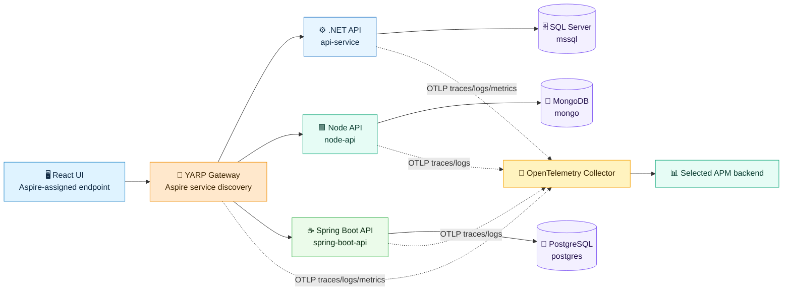


## Observability Backends

### 1. Elastic APM / ELK Stack

```mermaid
graph LR
    APP["🚪 Gateway + APIs"] --> OTLP["📦 OTLP"]
    OTLP --> OC["🔭 OpenTelemetry Collector"]
    OC --> APM["🟣 Elastic APM Server"]
    APM --> ES["🔎 Elasticsearch"]
    ES --> KB["📊 Kibana"]

    classDef app fill:#E7F5FF,stroke:#1971C2,color:#102A43
    classDef protocol fill:#E8F1FF,stroke:#4C7BD9,color:#16325C
    classDef collector fill:#FFF3BF,stroke:#F59F00,color:#3A2500
    classDef elastic fill:#00BFB3,stroke:#00756E,color:#061D1B
    classDef ui fill:#F04E98,stroke:#A91F62,color:#fff
    class APP app
    class OTLP protocol
    class OC collector
    class APM,ES elastic
    class KB ui
```

### 2. Azure Application Insights

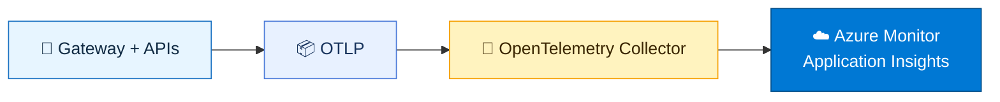

### 3. Datadog APM

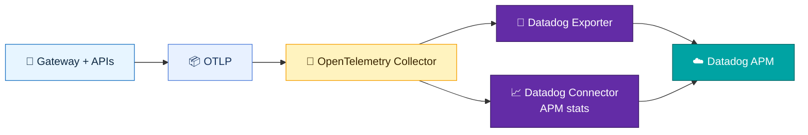

### 4. Jaeger

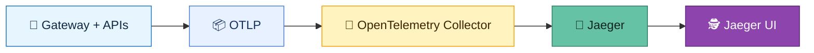

### 5. Grafana Tempo

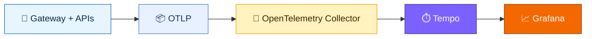

### 6. Full Grafana Stack

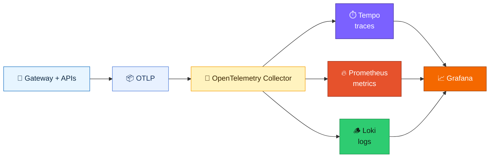

## How to Run

### Prerequisites

- Docker Desktop
- .NET 10 SDK
- Aspire workload installed (`dotnet workload install aspire`)

### Running with Different Backends

Set the `OBSERVABILITY_BACKEND` environment variable before running:

```powershell
# Elastic APM / ELK Stack
$env:OBSERVABILITY_BACKEND="elastic"
dotnet run --project src/AspireApmBackendsDemo.AppHost

# Azure Application Insights
$env:OBSERVABILITY_BACKEND="appinsights"
$env:APPLICATIONINSIGHTS_CONNECTION_STRING="your-connection-string"
dotnet run --project src/AspireApmBackendsDemo.AppHost

# Datadog APM
$env:OBSERVABILITY_BACKEND="datadog"
$env:DD_API_KEY="your-datadog-api-key"
$env:DD_SITE="datadoghq.com"
dotnet run --project src/AspireApmBackendsDemo.AppHost

# Jaeger
$env:OBSERVABILITY_BACKEND="jaeger"
dotnet run --project src/AspireApmBackendsDemo.AppHost

# Grafana Tempo
$env:OBSERVABILITY_BACKEND="tempo"
dotnet run --project src/AspireApmBackendsDemo.AppHost

# Full Grafana Stack (Tempo + Prometheus + Loki)
$env:OBSERVABILITY_BACKEND="grafana-full"
dotnet run --project src/AspireApmBackendsDemo.AppHost
```

## Application Insights Setup

When using `appinsights`, set `APPLICATIONINSIGHTS_CONNECTION_STRING`:

```powershell
$env:APPLICATIONINSIGHTS_CONNECTION_STRING="InstrumentationKey=your-key;IngestionEndpoint=https://your-endpoint.in.applicationinsights.azure.com/"
```

Do not hardcode this value. Use environment variables, user secrets, or Azure Key Vault in production.

## Datadog Setup

When using `datadog`, set `DD_API_KEY` before starting Aspire. `DD_SITE` defaults to `datadoghq.com`; set it to your Datadog site such as `datadoghq.eu`, `us3.datadoghq.com`, or `us5.datadoghq.com` when needed.

```powershell
$env:DD_API_KEY="your-datadog-api-key"
$env:DD_SITE="datadoghq.com"
```

Do not hardcode API keys. Use user secrets, environment variables, or your secret manager in production.

## Deploy To Azure Container Apps

Use the GitHub Actions workflow [deploy.yml](C:/Users/fnand/source/repos/oltp-options/.github/workflows/deploy.yml) to deploy the Aspire app to Azure Container Apps with a selected observability backend.

1. In GitHub, open **Actions**.
2. Select **Deploy Aspire Apm Backends Demo**.
3. Click **Run workflow**.
4. Choose `observability_backend`.
5. Run the workflow.

Supported `observability_backend` values:

```text
elastic
appinsights
datadog
jaeger
tempo
grafana-full
```

The workflow sets `OBSERVABILITY_BACKEND` from that input, then runs:

```bash
aspire deploy \
  --project src/AspireApmBackendsDemo.AppHost/AspireApmBackendsDemo.AppHost.csproj \
  --non-interactive
```

Configure these GitHub repository variables before deploying:

```text
AZURE_CLIENT_ID
AZURE_TENANT_ID
AZURE_SUBSCRIPTION_ID
AZURE_LOCATION
AZURE_RESOURCE_GROUP
APP_CONFIG_NAME
KEY_VAULT_NAME
```

Backend-specific values are also required for some modes. For `appinsights`, provide `APPLICATIONINSIGHTS_CONNECTION_STRING`. For `datadog`, provide `DD_API_KEY` and optionally `DD_SITE`.

## Test Commands
[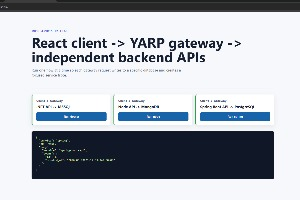](imgs/react-ui-test.png)

After starting the application, call backend APIs through the YARP gateway. The React UI also calls the gateway, never the backend APIs directly. Each API writes to its own database and does not call the other APIs.

Aspire assigns the application-facing host endpoints at run time. Open the Aspire dashboard and use the `react-ui` endpoint for the browser, or copy the `gateway` endpoint for direct API calls.


```powershell
# Replace <gateway-url> with the gateway endpoint shown in the Aspire dashboard.

# Gateway route map
curl <gateway-url>/

# Independent microservice traces through the gateway
curl <gateway-url>/api/dotnet/work
curl <gateway-url>/api/node/work
curl <gateway-url>/api/spring/work

# Existing .NET demo endpoints through the gateway
curl <gateway-url>/api/dotnet/custom-span
curl <gateway-url>/api/dotnet/outgoing
curl <gateway-url>/api/dotnet/random
```

## Where to View Telemetry

| Backend | UI URL | Notes |Print Screens|
|---------|--------|-------|-------|
| Elastic | http://localhost:5601 | Kibana -> Observability -> APM -> Services |[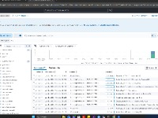](imgs/kibana-elastic-logspng.png)|
| Application Insights | Azure Portal | Application Insights -> Transaction Search / Application Map / Failures |[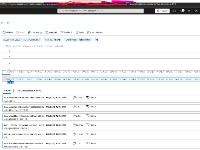](imgs/azure-appinsights-traces.png)|
| Datadog | https://app.datadoghq.com/apm/services | APM -> Services -> `gateway`, `api-service`, `node-api`, or `spring-boot-api`; use the matching Datadog site URL when `DD_SITE` is not `datadoghq.com` |[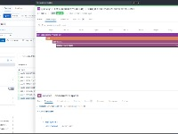](imgs/datadog-traces.png)|
| Jaeger | http://localhost:16686 | Search traces by service `gateway`, then inspect child backend spans |[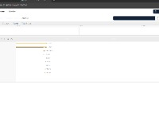](imgs/jaeger-traces.png)|
| Tempo | http://localhost:3000 | Grafana -> Explore -> Tempo datasource |
| Grafana Full | http://localhost:3000 | Explore Tempo for traces; Explore Loki with `{service_name="api-service"}`, `{service_name="gateway"}`, `{service_name="node-api"}`, or `{service_name="spring-boot-api"}` |[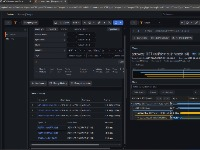](imgs/grafana-tempo-traces.png)|

Node API and Spring Boot API emit OTLP logs. Those logs are exported only by backend modes with a logs pipeline: `elastic`, `appinsights`, `datadog`, and `grafana-full`. Jaeger and Tempo modes remain trace-only.

## Backend Comparison

| Feature | Elastic APM | Application Insights | Datadog APM | Jaeger | Grafana Tempo | Full Grafana Stack |
|---------|-------------|---------------------|-------------|--------|---------------|---------------------|
| **Traces** | Yes | Yes | Yes | Yes | Yes | Yes |
| **Metrics** | Yes | Yes | Yes | No | No | Yes (Prometheus) |
| **Logs** | Yes (ELK) | Yes | Yes | No | No | Yes (Loki) |
| **UI** | Kibana | Azure Portal | Datadog | Jaeger UI | Grafana | Grafana |
| **Hosting** | Self-hosted | Azure-managed | Datadog-managed | Self-hosted | Self-hosted | Self-hosted |
| **Best For** | Full observability with Elasticsearch | Teams already in Azure | Teams already using Datadog APM | Simple trace visualization | Trace-focused teams | Complete observability stack |
| **Complexity** | Medium-High | Low | Low-Medium | Low | Medium | High |

## Cleanup

Stop the Aspire orchestration with Ctrl+C. If containers are left behind, stop them from Docker Desktop or run:

```powershell
docker ps --filter "name=otel-collector" --filter "name=elasticsearch" --filter "name=kibana" --filter "name=apm-server" --filter "name=jaeger" --filter "name=tempo" --filter "name=prometheus" --filter "name=loki" --filter "name=grafana" -q | ForEach-Object { docker stop $_ }
```
## Next To Do

Add database engine observability in addition to application-side database spans:

- Add PostgreSQL engine metrics with `postgres_exporter` in `grafana-full` mode.
- Add MongoDB engine metrics with `mongodb_exporter` in `grafana-full` mode.
- Add SQL Server engine metrics with a SQL Server exporter or Telegraf in `grafana-full` mode.
- Add Grafana dashboards for database connections, query latency, locks, cache, IO, and errors.
- Add optional Datadog Agent database integrations for SQL Server, MongoDB, and PostgreSQL in `datadog` mode.

