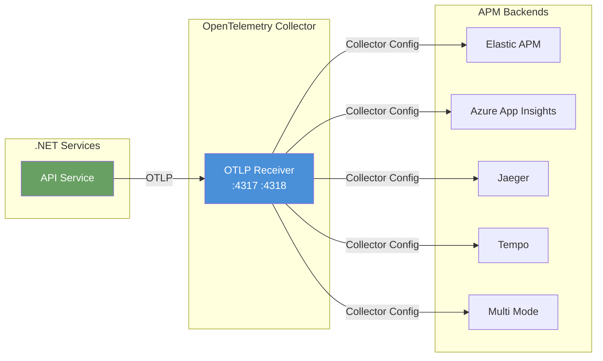

# .NET Aspire APM Backend Comparison Demo

A proof-of-concept demonstrating how to test and compare multiple APM/observability backends using OpenTelemetry Collector with .NET Aspire.

The application code **stays backend-neutral** - all telemetry is exported via OTLP to the OpenTelemetry Collector, which then forwards data to the selected APM backend.

## Architecture



## Exporter vs Collector

### Application Exporter (This Demo)
- The .NET application **only exports via OTLP** using `OpenTelemetry.Exporter.OpenTelemetryProtocol`
- **No backend-specific SDKs** are used (no Elastic APM SDK, no Application Insights SDK, etc.)
- The exporter sends telemetry to the OpenTelemetry Collector's OTLP receiver

### Collector
- Receives OTLP from the application
- Uses **collector configuration** to route data to the selected APM backend
- Enables **backend switching without changing application code**
- Only the collector config and infrastructure change

## Running the Demo

### Prerequisites
- .NET 10 SDK
- Docker Desktop (for containerized backends)
- For App Insights mode: `APPLICATIONINSIGHTS_CONNECTION_STRING` environment variable

### Supported Backends

Set the `OBSERVABILITY_BACKEND` environment variable to switch backends:

```bash
OBSERVABILITY_BACKEND=elastic    # Elastic APM
OBSERVABILITY_BACKEND=appinsights # Azure Application Insights
OBSERVABILITY_BACKEND=jaeger      # Jaeger
OBSERVABILITY_BACKEND=tempo       # Grafana Tempo
OBSERVABILITY_BACKEND=multi       # All backends simultaneously
```

### Running Each Mode

#### Elastic APM
```bash
cd AspireApmBackendsDemo
dotnet run --project AspireApmBackendsDemo.AppHost
# Access Kibana: http://localhost:5601
# Default credentials: elastic / changeme (or disabled for local dev)
```

#### Azure Application Insights
```bash
# Set your connection string first
export APPLICATIONINSIGHTS_CONNECTION_STRING="InstrumentationKey=xxx;IngestionEndpoint=https://xxxx.in.applicationinsights.azure.com/"

dotnet run --project AspireApmBackendsDemo.AppHost
# View in Azure Portal -> Application Insights -> Transaction Search
```

#### Jaeger
```bash
OBSERVABILITY_BACKEND=jaeger dotnet run --project AspireApmBackendsDemo.AppHost
# Access Jaeger UI: http://localhost:16686
```

#### Grafana Tempo
```bash
OBSERVABILITY_BACKEND=tempo dotnet run --project AspireApmBackendsDemo.AppHost
# Access Grafana: http://localhost:3000 (admin / admin)
# Default datasources already configured
```

#### Multi-Backend Mode
```bash
dotnet run --project AspireApmBackendsDemo.AppHost
# Start all backends to compare telemetry side-by-side
```

### API Service Endpoints

Test the API service at `http://localhost:8080`:

| Endpoint | Description |
|----------|-------------|
| GET / | Simple health check |
| GET /health | Returns OK |
| GET /error | Throws exception (test error capture) |
| GET /slow | 2-second delay (test latency traces) |
| GET /outgoing | HTTP call to httpbin.org (test outgoing spans) |
| GET /logs | Logs at Info/Warn/Error levels |
| GET /custom-span | Creates custom Activity with tags/events |
| GET /random | Randomly returns success, slow, or error |

### Testing with curl

```bash
# Basic health
curl http://localhost:8080/

# Health check
curl http://localhost:8080/health

# Test error capture
curl http://localhost:8080/error

# Test latency tracing
curl http://localhost:8080/slow

# Test outgoing HTTP spans
curl http://localhost:8080/outgoing

# Test logging
curl http://localhost:8080/logs

# Test custom spans
curl http://localhost:8080/custom-span

# Test random behavior
curl http://localhost:8080/random
```

## Where to View Telemetry

### Kibana (Elastic APM)
1. Navigate to http://localhost:5601
2. Go to **Observability** -> **APM** -> **Services**
3. Select `api-service` to see traces, errors, and metrics

### Azure Application Insights
1. Navigate to your Application Insights resource in Azure Portal
2. Use **Transaction Search** to find traces
3. Use **Application Map** for service dependencies
4. Use **Live Metrics** for real-time monitoring

### Jaeger UI
1. Navigate to http://localhost:16686
2. Select `api-service` from the service dropdown
3. Search for traces and analyze spans

### Grafana Tempo
1. Navigate to http://localhost:3000
2. Go to **Explore** -> Select **Tempo** datasource
3. Search for traces by service name or other attributes

## Backend Comparison

| Backend | Traces | Metrics | Logs | Distributed Tracing | Error Tracking | APM Features |
|---------|--------|---------|------|---------------------|----------------|--------------|
| **Elastic APM** | ✅ | ✅ | ✅ | ✅ | ✅ | Service maps, code profiling, slow queries |
| **Azure App Insights** | ✅ | ✅ | ✅ | ✅ | ✅ | Live metrics, Application Map, Profiler |
| **Jaeger** | ✅ | ❌ | ❌ | ✅ | ❌ | Basic trace visualization, span comparison |
| **Tempo** | ✅ | ⚠️ | ⚠️ | ✅ | ❌ | Best with Grafana, Prometheus, Loki |

**Note:** Jaeger and Tempo are primarily tracing-focused. For full observability (metrics, logs), pair them with Prometheus and Loki, or use Elastic APM / Application Insights.

## Environment Variables

### Application Service (set automatically by AppHost)
| Variable | Value | Description |
|----------|-------|-------------|
| `OTEL_SERVICE_NAME` | `api-service` | Service identifier |
| `OTEL_EXPORTER_OTLP_ENDPOINT` | `http://otel-collector:4317` | Collector endpoint |
| `OTEL_EXPORTER_OTLP_PROTOCOL` | `grpc` | Protocol to use |

### Collector (set by AppHost based on backend)
| Variable | Description |
|----------|-------------|
| `OBSERVABILITY_BACKEND` | Backend mode: `elastic`, `appinsights`, `jaeger`, `tempo`, `multi` |
| `APPLICATIONINSIGHTS_CONNECTION_STRING` | Azure App Insights connection string (for appinsights/multi modes) |

### Collector Configuration Files

| File | Description |
|------|-------------|
| `otel/collector-elastic.yml` | Routes telemetry to Elastic APM Server |
| `otel/collector-appinsights.yml` | Routes telemetry to Azure Application Insights |
| `otel/collector-jaeger.yml` | Routes telemetry to Jaeger (traces only) |
| `otel/collector-tempo.yml` | Routes telemetry to Grafana Tempo (traces only) |
| `otel/collector-multi.yml` | Routes telemetry to multiple backends simultaneously |

## Infrastructure Configuration

| File | Description |
|------|-------------|
| `otel/apm-server.yml` | Elastic APM Server configuration |
| `otel/tempo.yml` | Grafana Tempo configuration |
| `otel/grafana-datasources.yml` | Auto-provisions Tempo and Prometheus datasources in Grafana |
| `otel/prometheus.yml` | Prometheus scrape configuration |

## Container Ports

| Service | Port | Description |
|---------|------|-------------|
| API Service | 8080 | REST API |
| OTel Collector (gRPC) | 4317 | OTLP receiver |
| OTel Collector (HTTP) | 4318 | OTLP receiver |
| Elasticsearch | 9200 | Elastic search |
| Kibana | 5601 | Elastic observability UI |
| APM Server | 8200 | Elastic APM Server |
| Jaeger UI | 16686 | Jaeger web UI |
| Grafana | 3000 | Grafana dashboard |
| Tempo | 3100 | Tempo query endpoint |

## Key Benefits of This Architecture

1. **Backend-neutral application**: The API service has no dependency on any APM backend SDK
2. **Seamless backend switching**: Change `OBSERVABILITY_BACKEND` to switch observability providers
3. **No code changes**: Application code stays the same; only infrastructure and collector config change
4. **Multi-backend comparison**: Use `multi` mode to send telemetry to multiple backends simultaneously
5. **Standardized telemetry**: All telemetry is OTLP, making it vendor-neutral

## Project Structure

```
AspireApmBackendsDemo/
├── AspireApmBackendsDemo.AppHost/     # .NET Aspire orchestration
├── AspireApmBackendsDemo.ApiService/  # ASP.NET Core Minimal API
├── AspireApmBackendsDemo.ServiceDefaults/  # Shared configuration
├── AspireApmBackendsDemo.Web/         # (Not used in this demo)
├── otel/                              # OTel Collector and infrastructure configs
│   ├── collector-elastic.yml
│   ├── collector-appinsights.yml
│   ├── collector-jaeger.yml
│   ├── collector-tempo.yml
│   ├── collector-multi.yml
│   ├── apm-server.yml
│   ├── tempo.yml
│   ├── prometheus.yml
│   └── grafana-datasources.yml
└── README.md
```

## Troubleshooting

### Collector not receiving data
- Check that `OTEL_EXPORTER_OTLP_ENDPOINT` is set to `http://otel-collector:4317`
- Verify the collector container is running and ports are exposed
- Check collector logs for any configuration errors

### No traces in APM backend
- Verify the correct collector config is mounted
- For Elastic: ensure Elasticsearch and APM Server are running
- For App Insights: verify `APPLICATIONINSIGHTS_CONNECTION_STRING` is set
- Check the debug exporter in collector config to see if data is being received

### Containers not starting
- Ensure Docker Desktop is running
- Check `docker ps` to see running containers
- Check Aspire dashboard for container status